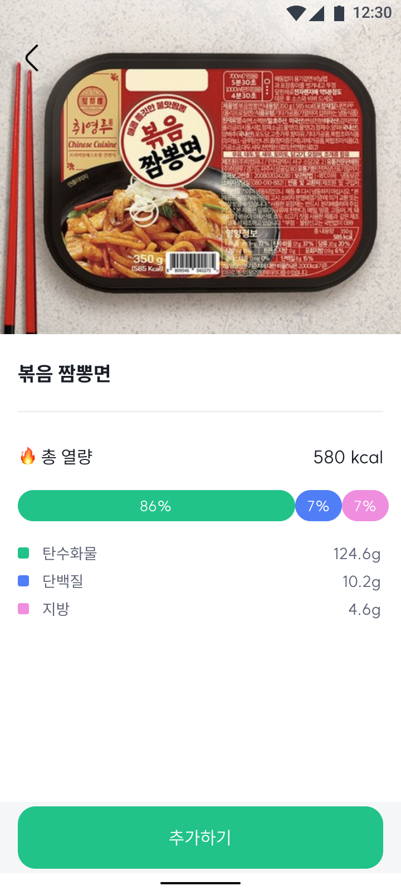
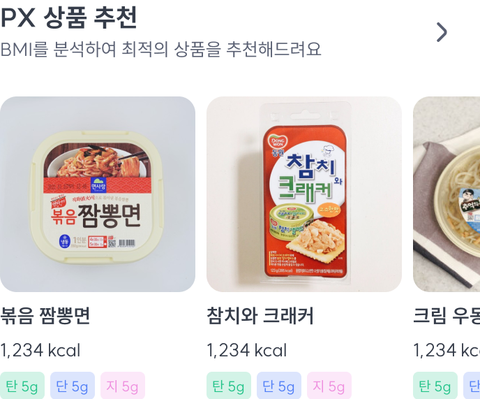

# jjammate-app

## 디렉토리 구조

- src
    - @types(데이터 타입 모음)
        - nutrition 영양 관련 데이터 타입
    - assets(이미지, 아이콘, 디자인 토큰)
    - components(각종 컴포넌트)
        - common(자주 쓰는 검포넌트)
            - CardView(카드형태의 뷰)
            
            - Check(체크형태의 on off toggle)
            
            - CheckBox(체크형태의 on off toggle)
            
            - CustomButton(버튼)
            
            - CustomInput(텍스트 인풋)
            
        - nutrition(영양 관련 컴포넌트)
            - NutrientRatio(탄단지 가로 퍼센트 그래프)
            
            - PxItem(Px아이템 자세히 보기)
            
            - PxRecommend(Px아이템 추천 리스트)
            
            - Wrap(가로 양옆을 5프로씩 비워주는 레이어)
        - text(텍스트 컴포넌트 피그마랑 이름 똑같음)
    - screens(화면)
        - Register(회원가입)
            - RegisterAgreeScreen(정책동의 화면)
            - RegisterCompleteScreen(회원가입 완료시 나오는 화면)
            - RegisterDepartmentScreen(부대 입력 화면[자동완성형식])
            - RegisterInfoScreen(키,몸무게 등 여러 정보 입력화면)
            - RegisterInputScreen(이름, 군번 등 한가지 정보 입력 화면)
            - RegisterScreen(회원가입 인덱스 화면)
        - HomeScreen(홤화면)
        - LaunchScreen(로그인 회원가입 선택 화면)
        - LoginScreen(로그인화면)
        - MainScreen(인덱스화면)
        - NutritionScreen(영양화면)
        - PxListScreen(PX 제품 리스트 화면)
    - states(전역상태관리)
        - register
            - registerInfoAtom 회원 가입 정보
            - registerAgreeAtom 정책 동의 여부
        - setting
            - autoLoginState 자동 로그인 정보

## 사용한 패키지

- "@ptomasroos/react-native-multi-slider" 슬라이더 기능

- "@react-native-async-storage/async-storage": "^1.18.2", 로컬 저장소
- "@react-navigation/bottom-tabs": "^6.5.7", 화면 전환(Main Screen)
- "@react-navigation/native": "^6.1.6", 화면 전환
- "@react-navigation/native-stack": "^6.9.12", 화면 전환(register Screen)
- "@react-navigation/stack": "^6.3.16", 화면 전환
- "react-native-keyboard-aware-scroll-view": "^0.9.5", 키보드 올라오는거 감지 (회원가입 정보입력페이지)
- "react-native-picker-select": "^8.0.4", select 컴포넌트

- "react-native-safe-area-context": "^4.5.3", 노치나 아래 굴곡진 부분 화면 높이, 너비 확인
- "react-native-shadow-2": "^7.0.8", 컴포넌트 그림자
- "react-native-slick": "^1.6.0", 슬릭 슬라디어
- "react-native-svg": "^13.9.0", svg 불러오기
- "react-native-svg-charts": "^5.4.0", 원형 차트

- "recoil": "^0.7.7" 상태관리
